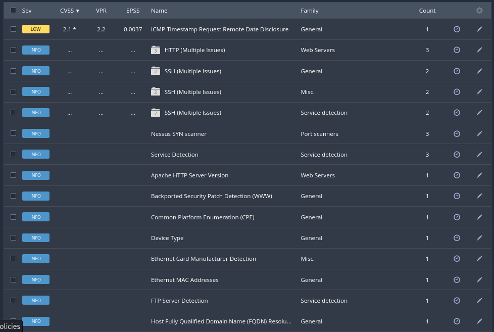

## Project Overview

This project demonstrates the use of Nessus Essentials to perform a vulnerability assessment against an Ubuntu Virtual Machine (VM) and forward the scan results into Splunk Enterprise for SIEM-style analysis.

By combining Nessus scanning with Splunk dashboards, this project simulates how a SOC analyst would manage vulnerabilities, monitor network exposure, and track IOCs in a real environment.

## Lab Setup

- Attacker Machine: Kali Linux (Nessus Essentials + Splunk Forwarder)

- Target Machine: Ubuntu VM (running on VMware Workstation)

- Splunk Environment: Splunk Enterprise (local instance)

- Data Ingestion: Nessus scan exported as CSV → uploaded into Splunk

## Scan Configuration

- Scan Type: Basic Network Scan

- Target IP: 192.168.1.244

- Options: Service detection, OS fingerprinting, vulnerability checks

## Scan Findings
1. **Open Ports & Services Detected**

- 22/tcp → SSH (OpenSSH 9.6p1 Ubuntu-3ubuntu13.13)

- 21/tcp → FTP (vsftpd server detected)

- 80/tcp → HTTP (Apache HTTP server detected)

2. **Vulnerabilities**
- Low: ICMP Timestamp Disclosure (host clock leak)

- Info: SSH allows password authentication

- Info: SSH uses weak SHA-1 HMAC algorithms

- Info: Apache version exposed

- Info: FTP banner revealed

- Info: OS fingerprints detected

- Indicators of Compromise (IOCs)

- SSH Password Authentication Accepted → weak authentication mechanism

- SSH HMAC SHA-1 Algorithms Enabled → cryptographic weakness

- ICMP Timestamp Response Enabled → system time exposure

- Service Fingerprinting Detected → attacker can map environment

- VMware Virtual Machine Detected → indicates virtualizatio
  

**Splunk Dashboard Integration**

Nessus scan results were exported to CSV and ingested into Splunk Enterprise, where they were visualized for SOC-style monitoring.
