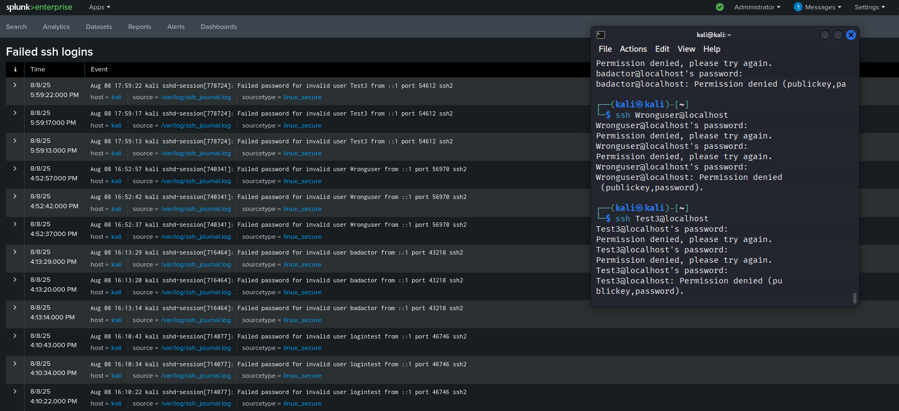
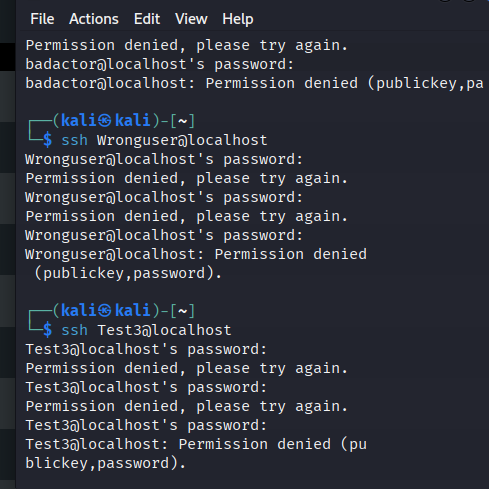

# SSH Login Failure Monitoring with Splunk

## Project Overview
This project monitors SSH login failures on a kali Linux system using Splunk. It captures failed login attempts from system logs (/var/log/ssh_journal.log), visualizes the data on a dashboard for monitoring failed SSH login alerts.
## Features
- Real-time monitoring of SSH failed login attempts
- Custom Splunk dashboard for visualizing failed login events
- Easy integration with Linux system logs

## Setup Instructions

1. Configure Splunk to Monitor SSH Logs
2. Create a Search Query for Failed SSH Logins
3. Create a Splunk Dashboard

## Usage
- Open the Splunk dashboard to monitor SSH login failures in real time.
- Investigate suspicious IPs or user patterns.
- Tune alerts and dashboard filters as needed.

## Screenshots

*Dashboard visualizing failed SSH logins.*

 
*Commandline showing failed SSH login attempt.*

## Troubleshooting
- Confirm Splunk user permissions to read /var/log/ssh_journal.log.
- Check the system time zone and Splunk time settings for accurate timestamps.
- Verify logs are written to /var/log/ssh_journal.log in real time.

