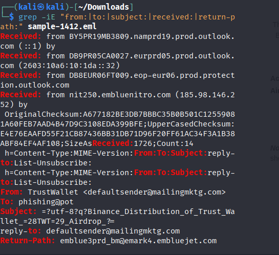
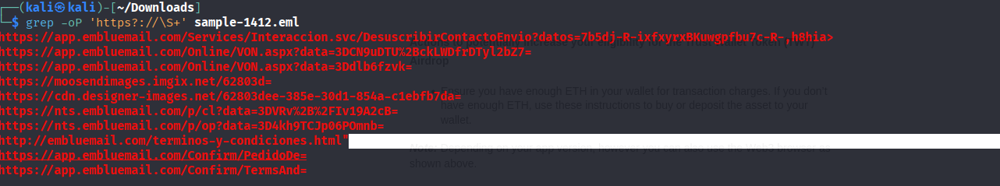

## Project Overview
**Objective:** Analyze a phishing email for signs of malicious intent.  
- **Tools Used:**  
  - `grep` (header analysis)  
  - `grep -oP 'https?://\S+'` (URL extraction)  
  - Thunderbird (for safe viewing)  
- **Dataset:** Sample phishing email (`sample-1412.eml`).  

** Step 1: Email Header Analysis**
Used `grep` to extract metadata such as sender, recipient, subject, and return path:  

()

**Findings:**
From: TrustWallet <defaultsender@mailingmktg.com>

To: phishing@pot

Subject: Binance Distribution of Trust Wallet (TWT) Airdrop

Return-Path: emblue3prd_bm@emark4.embluejet.com

**Step 2: Extract URLs**

Extracted all links in the email using regex:

Extracted URLs:
- https://app.embluemail.com/Services/Interaccion.svc/DesuscribirContactoEnvio?...
- https://app.embluemail.com/Online/VON.aspx?data=3DCN9uDTU%2BckLWDfrDTyl2bZ7=
- https://app.embluemail.com/Online/VON.aspx?data=3Ddlb6fzvk=
- https://moosendimages.imgix.net/62803d=
- https://cdn.designer-images.net/62803dee-385e-30d1-854a-c1ebfb7da=
- https://nts.embluemail.com/p/cl?data=3DVRv%2B%2FIv19A2cB=
- https://nts.embluemail.com/p/op?data=3D4kh9TCJp06POmnb=
- http://embluemail.com/terminos-y-condiciones.html
- https://app.embluemail.com/Confirm/PedidoDe=
- https://app.embluemail.com/Confirm/TermsAnd=

**##Indicators of Compromise (IOCs)**
Below are the artifacts extracted from the phishing email (sample-1412.eml):

Email Artifacts
From: TrustWallet <defaultsender@mailingmktg.com>
Reply-To: defaultsender@mailingmktg.com
Return-Path: emblue3prd_bm@emark4.embluejet.com
Subject: Binance Distribution of Trust Wallet (TWT) Airdrop

**Malicious / Suspicious URLs**
- https://app.embluemail.com/Services/Interaccion.svc/DesuscribirContactoEnvio?...
- https://app.embluemail.com/Online/VON.aspx?data=3DCN9uDTU%2BckLWDfrDTyl2bZ7...
- https://nts.embluemail.com/p/cl?data=3DVRv%2B%2FIv19A2cB..
- http://embluemail.com/terminos-y-condiciones.html
- https://nts.embluemail.com/p/op?data=3D4kh9TCJp06POmnb...

**Domains of Interest**
- embluemail.com
- emark4.embluejet.com
- mailingmktg.com

**Observed Techniques**
- Domain spoofing (fake TrustWallet branding)
- Use of tracking / redirect URLs
- Financial lure ("Binance / TrustWallet airdrop")

**Security Impact**
1 Phishing campaign pretending to be Binance/TrustWallet airdrop

2 Aim: Steal credentials or deliver malware via malicious links

3 Risk: High (financial theft, credential compromise)
